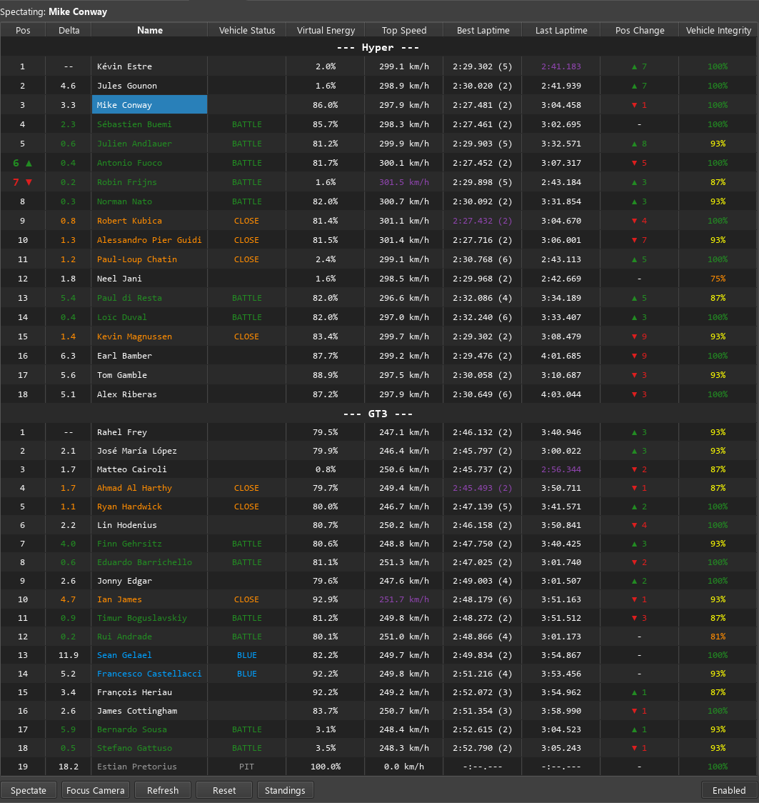

# TinyPedal Broadcast — Full Feature List

Screenshot: 

This README summarizes all broadcast / spectator features implemented in this build.

Important: to run the app download the latest published release and run the provided executable (no build steps required).

## Overview

The broadcast UI provides a compact, high-frequency spectator view of all vehicles in the session with per-class grouping, live timing, and vehicle status indicators.

## Core broadcast features

- Spectator controls
  - Enable/disable broadcast (player index override) toggle
  - Select a driver to spectate by clicking or double-clicking the name
  - `Spectate`, `Focus Camera`, `Refresh`, and `Reset` buttons
  - Focus camera will call the reader API to follow the spectated vehicle

- Live update timers
  - Timing updates run at ~10Hz (100 ms) for time-sensitive counters
  - Top-speed polling runs at ~200 ms to compute live max top speeds per vehicle
  - Periodic auto-refresh of the driver list (~0.5 s) to keep the UI responsive

## Driver list columns

- `Pos` — class position (with sticky up/down arrow on recent position changes)
  - Arrow indicates a recent class position change; arrow remains visible for a short sticky duration
- `Delta` — gap to the car ahead in class, showing a compact one-decimal value when timing available
- `Name` — driver name (selectable)
- `Vehicle Status` — combined status tags (penalties, PIT, CHEQUERED, YELLOW, BLUE, BATTLE, CLOSE)
  - `PIT` overrides `CHEQUERED`
  - `CHEQUERED` overrides other non-pit tags
  - Penalty tag (PEN (1)) is shown when a penalty exists
- `Virtual Energy` — simple percentage per-driver (VE fraction interpreted from multiple available readers)
- `Top Speed` — live top speed (kph) tracked per stable vehicle slot id
  - The UI highlights the highest top speed in each class
- `Best Laptime` — best lap formatted for display, includes lap number when detected
  - Best-per-class is highlighted
- `Last Laptime` — most recent completed lap, formatted; most recent-per-class is highlighted
- `Pos Change` — class-relative change vs class starting grid
  - Shows `? N` (green) for gains, `? N` (red) for losses, `-` for no change, `--` when grid info unavailable
  - Gap between arrow and count for readability (e.g., `? 3`)
  - Starting grid per-class is inferred from `qualification` values and converted to a class-rank
- `Vehicle Integrity` — percent with color-coded thresholds
  - 100%: green
  - below 50%: red
  - below 87% (strict): orange
  - otherwise: yellow

## Per-class highlights and analysis

- Class grouping and headers are shown (each class lists its drivers)
- Highlights per class:
  - Highest top speed highlighted
  - Best lap highlighted
  - Most recent (last) lap highlighted
- Battles and close-proximity detection
  - On-track drivers are analyzed by estimated time-into-lap to find pairs within proximity thresholds
  - `BATTLE` (tight proximity) and `CLOSE` (nearby) tags are applied and used for coloring
- Lapping detection
  - Non-blue drivers near a blue-flagged car are marked as lapping

## Sticky states and heuristics

- Yellow state detection uses vehicle speed thresholds with a short sticky duration so a slow driver remains marked briefly after recovering
- Position-change arrows are sticky for a configurable short duration so recent gains/losses remain visible
- Top speeds are stored per vehicle slot id (stable across order/class changes)

## Virtual energy (VE) handling

- Uses a centralized reader helper to support legacy module data (fraction 0..1), absolute (`ve`/`max_e`) or percentage (0..100) readers
- The driver list shows only a compact percentage string

## Resets and caching

- `Reset` clears cached top speeds, yellow timestamps, and other transient mappings and forces a refresh

## Notes and caveats

- Many behaviors rely on the reader API and available LMU/module data — values may be missing or unavailable depending on the data source and simulator state
- Class-relative starting grid inference uses `api.read.vehicle.qualification()` when present; if qualification values are missing the `Pos Change` column will show `--`
